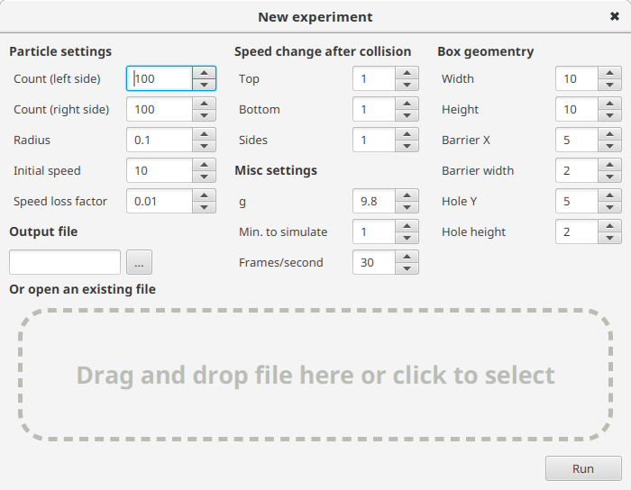
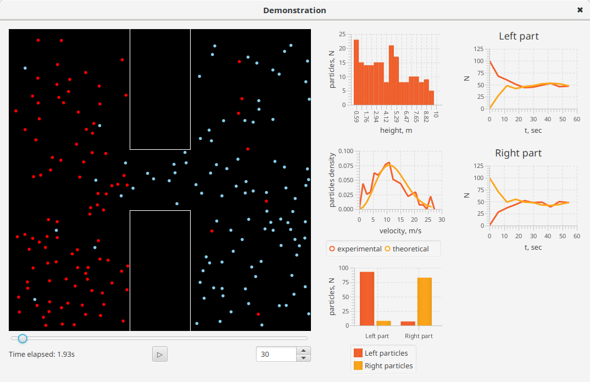

# Particles In Box - Java Implementation

# About

Particles in Box is a desktop program designed to demonstrate the behavior of
gas particles in an enclosed area (a box). This project is curated by a National
Research University of Electronic Technology professor [Gennady Gaidukov](https://www.miet.ru/person/44517).

# Technical information

## Experiment files

Particle in Box stores experiment-related information in a binary file
structured by the following rules:

1. The first 72 bytes are the settings

    * Number of particles created within the *left* part of the box (4-byte integer)
    * Number of particles created within the *right* part of the box (4-byte integer)
    * Initial speed of particles (4-byte float)
    * Speed loss factor (4-byte float)
    * Speed change after collision with the *top* of the box (4-byte float)
    * Speed change after collision with the *sides* of the box (4-byte float)
    * Speed change after collision with the *bottom* of the box (4-byte float)
    * The free-fall acceleration (g) (4-byte float)
    * Box width (4-byte float)
    * Box height (4-byte float)
    * Barrier X position (4-byte float)
    * Barrier width (4-byte float)
    * Hole Y position (4-byte float)
    * Hole height (4-byte float)
    * Particle radius (4-byte float)
    * Frames per second (4-byte int)
    * Experiment length in minutes (4-byte int)
    * Random seed (4-byte int)
2. The rest of the file consists of particle data at a fixed point in time.
    This data comes in chunks of fixed size (which depends on particle count).

    The structure is as follows:

    * Timestamp (microseconds passed since the start of the simulation) (8-byte long)
    * State of each particle at the given moment of time
        * ID (4-byte integer)
        * X coordinate (8-byte double)
        * Y coordinate (8-byte double)
        * Velocity X coordinate (8-byte double)
        * Velocity Y component (8-byte double)

    Hence, the size of each data chunk can be calculated using a simple formula `Size = (8 + N * 36) Bytes`, where N is the total particle count.
